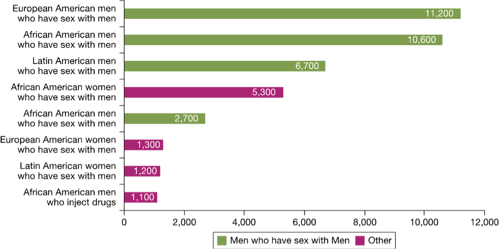

# ¿Qué es el VIH?
**Virus de la Inmunodeficiencia Humana (VIH)**

Un virus de transmisión sexual que destruye los glóbulos blancos del sistema inmunológico, dejando al cuerpo vulnerable a enfermedades potencialmente mortales.

:::important[¿Sabías que...?]
* Más de 1.2 millones de estadounidenses viven con VIH/SIDA.
* A nivel mundial, la mitad de las infecciones son entre mujeres, pero en EE. UU., el VIH se da principalmente entre hombres que comparten agujas o tienen relaciones sexuales con otros hombres.
* El VIH sigue siendo un problema importante de salud mundial, con un estimado de 42.3 millones de muertes y transmisión continua en todo el mundo.
:::

| Cómo responde tu sistema inmunológico | Cómo el VIH debilita tus defensas |
| ------ | ------------------------------------------------------------------------- |
| • El sistema inmunológico produce glóbulos blancos (leucocitos) para matar patógenos. | • El VIH se adhiere a células inmunológicas especiales llamadas células CD4 y las utiliza para hacer copias de sí mismo. |
| • Los leucocitos reconocen patógenos mediante antígenos de superficie, donde se adhieren los anticuerpos. | • Destruye estas células CD4 con el tiempo, debilitando el sistema inmunológico. |
| • La inflamación expande el flujo sanguíneo, trayendo más leucocitos al área. | • Cuando se pierden demasiadas células CD4 (menos de 200 células por milímetro de sangre), el cuerpo se vuelve muy vulnerable a infecciones. |

------------------------------------------------------------------------------------------------------------------------------

**Progresión del VIH**

El VIH se propaga a través de ciertos fluidos corporales: sangre, semen, fluidos vaginales y leche materna.

* Pueden aparecer síntomas leves similares a la gripe poco después de la infección.
* Muchas personas permanecen sin síntomas durante años, mientras que otras desarrollan síntomas antes.

**Transmisión del VIH**
* La exposición (excepto por la leche materna) puede ocurrir mediante:
* Sexo vaginal, anal o oral-genital
* Compartir agujas o lesiones con agujas
* Transfusiones de sangre u órganos
* Inseminación artificial
* Parto

:::warning[Factores de riesgo]
* Número de contactos sexuales con una pareja infectada
* Tipo de actividad sexual
* Cantidad de virus en los fluidos corporales
* Otras infecciones de transmisión sexual (ITS)
* Estado de circuncisión
* Genética
:::

------------------------------------------------------------------------------------------------------------------------------

| **El VIH NO se transmite por ❌** | **Cómo se diagnostica el VIH 🩺** | **Tratamiento del VIH 💊** |
|-----------------------------------------------------------------------------------------------|---------------------------------------------------------------------------|------------------------------------------------------------------------------------------|
| • Donar sangre: Siempre se usan agujas estériles y seguras. | • El VIH se diagnostica detectando anticuerpos. | • La HAART (Terapia Antirretroviral Altamente Activa) usa una combinación de medicamentos antivirales. |
| • Contacto casual: No hay riesgo al abrazar, dar la mano o compartir baños. | • ELISA: Prueba común utilizando sangre, saliva u orina. | • La tasa de mortalidad por VIH en EE. UU. se redujo en un 75% desde los años 90. |
| • Picaduras de insectos o animales: El VIH no sobrevive en animales. | • OraQuick: Prueba rápida de anticuerpos, a veces para uso doméstico. | • El tratamiento es costoso. |
| • Gérmenes transmitidos por el aire o alimentos: El VIH no se propaga como los resfriados o intoxicaciones alimentarias. | • Los anticuerpos tardan semanas en aparecer (período de ventana). | • El acceso global a estos avances sigue siendo limitado. |
| • Compartir espacios: No hay riesgo al vivir o trabajar con alguien que tenga VIH. | • Los resultados positivos requieren confirmación. | |
| • Besos de boca cerrada: No hay riesgo. | | |

--------------------------------------------------------------------------------------------------------------

# **Signos y síntomas**
Los síntomas del VIH varían dependiendo de la etapa de la infección.

:::caution
El VIH se propaga más fácilmente en los primeros meses después de la infección, pero muchas personas no son conscientes de su estado hasta las etapas posteriores.
:::

--------------------------------------------------------------------------------------------------------------

### Datos sobre la ART (Tratamiento):

- Las personas que viven con VIH y toman terapia antirretroviral (ART) con una carga viral indetectable no transmiten el VIH a sus parejas sexuales.
- El acceso temprano a la ART y el apoyo para mantener el tratamiento son fundamentales no solo para mejorar la salud de quienes viven con VIH, sino también para prevenir la transmisión.
- La ART actual no cura la infección por VIH, pero permite que el sistema inmunológico se fortalezca. Esto ayuda a combatir otras infecciones.
- Actualmente, la ART debe tomarse todos los días durante el resto de la vida de una persona. La ART reduce la cantidad de virus en el cuerpo, detiene los síntomas y permite vivir una vida larga y saludable.

# Cuestionario Interactivo sobre el VIH

<iframe 
  src="https://editor.p5js.org/Ritbaven/full/fkXK7WBc0" 
  width="100%" 
  height="600" 
  style="border: none; margin-top: 20px;"
  loading="lazy"
  allowfullscreen
></iframe>

# Notas al pie

Referencias: 

https://www.who.int/news-room/fact-sheets/detail/hiv-aids ↩

https://www.gob.mx/censida ↩

Video por cgbp de https://pixabay.com ↩

Imagen por cromaconceptovisual de https://pixabay.com ↩

Imagen por Alexandra_Koch de https://pixabay.com ↩

Imagen por OpenClipart-Vectors de https://pixabay.com ↩

Imagen por roundsquid de https://pixabay.com ↩
